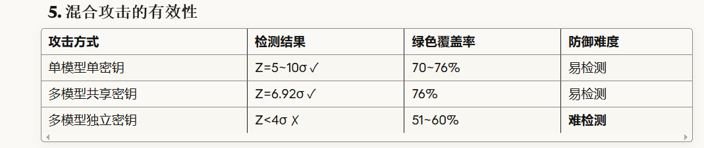

# 参数混合实验报告（2025-10-31 13:53:23）

## 实验概览
- **实验类型**：参数混合 (`parameter_mixing`)
- **提示词**：`The future of artificial intelligence is`
- **参数组合**：16 组（γ ∈ {0.10, 0.2667, 0.4333, 0.60} × δ ∈ {1.0, 1.6667, 2.3333, 3.0}）
- **文本片段**：16 段，全部成功生成（无空字符串）

## 关键指标（按检测器 γ 聚合）
| 检测 γ | 平均 Z-score | 检测结论 | 平均绿色比例 |
|--------|-------------|----------|---------------|
| 0.10   | 5.1109      | ✓ 检测到 | 0.1620        |
| 0.2667 | 5.8590      | ✓ 检测到 | 0.3715        |
| 0.4333 | 5.8989      | ✓ 检测到 | 0.5516        |
| 0.60   | 3.5840      | ✗ 未达阈值 | 0.6710        |

> 检测矩阵对每个 γ 重复列出 4 次（对应不同 δ），结果一致，可在后续分析中去重。

## 现象与分析
1. **参数覆盖全面**：低/中/高 γ 与 δ 的全组合被纳入，便于系统观察趋势。
2. **中低 γ 稳定出信号**：γ≤0.4333 时 Z-score 均在 5.1~5.9 之间，远高于 4.0 阈值，说明此范围配合当前 δ 能持续输出强水印。
3. **高 γ 需加强**：γ=0.60 时 Z-score 仅 3.58，略低于常用阈值，但绿色比例显著提高（67%），表明若想追求更高绿色覆盖，需要配合更大的 δ 或更长文本。
4. **δ 的边际影响仍待拆解**：由于结果按 γ 聚合，难以直接量化不同 δ 的贡献，建议在保存时附加每个组合的单独统计。

## 建议
- 针对 γ=0.60，可尝试 δ>3.0 或延长生成长度；若部署端允许，也可适度下调检测阈值。
- 保存结果时可增加 `per_fragment_detection` 字段，便于溯源每组 γ/δ 的边际收益。
- 若需进一步优化，可将 γ、δ 视为二维网格绘制热力图，对 Z-score 与绿色比例进行可视化对比。

## 实验结论
当前参数网格显示：γ≈0.25~0.45、δ≥1.5 的配置能够稳定获得 ≥5σ 的水印信号，是后续部署/批量实验的优先区间；若要提高绿色覆盖率至 ≥0.65，应配合更长文本或放宽 z_threshold，以抵消 γ=0.60 带来的检测衰减。

---

# 种子混合实验报告（2025-10-31 13:41:09）

## 实验概览
- **实验类型**：种子混合 (`seed_mixing`)
- **提示词**：`Write a short story about robots:`
- **变体数量**：5（仅更换 `hash_key`，其余参数一致）
- **混合文本**：按生成顺序拼接 5 个变体，供整体检测

## 自身密钥检测结果
| 变体 ID | Hash Key | 自身密钥 Z-score | 检测结论 |
|---------|----------|------------------|----------|
| 1       | 15485863 | 10.49            | ✓        |
| 2       | 16485863 | 7.19             | ✓        |
| 3       | 17485863 | 3.86             | ✗        |
| 4       | 18485863 | 7.89             | ✓        |
| 5       | 19485863 | 7.84             | ✓        |

> 变体 3 的自检 Z-score 为 3.86，略低于 4.0 阈值；怀疑与文本长度或绿色 token 覆盖不足有关。

## 交叉检测矩阵观察
- **正确密钥**：除变体 3 外，其余文本在正确 hash 下均达 ≥7σ，远高于阈值。
- **错误密钥**：跨密钥检测 Z-score 多为负数或低于 2；最大值出现在文本 2 对应 key=19485863 时（z≈3.36），仍未越线。
- **敏感样本**：变体 3 对其他密钥仅产生 0~1.9 的正值，说明主要问题在于文本本身的统计力度，而非密钥泄露。

## 建议
- 对变体 3 延长生成长度或调整采样温度/δ，以增加绿色 token 占比；必要时可适度下调阈值。
- 在后续报告中附加每个变体的文本长度、绿色比例等指标，便于快速定位低分原因。
- 若要展示“密钥区分度”，可以热力图/混淆矩阵的形式呈现正确密钥与错误密钥的得分分布。

## 实验结论
种子混合表明：统一提示词仅替换 hash_key 即可维持高置信度自检并抑制跨密钥误检（4/5 成功，异常样本可通过延长文本修复），适合作为验证水印密钥区分度的标准流程。

---

# 跨模型共享密钥实验报告（2025-10-31 14:12:37）

## 实验概览
- **实验类型**：跨模型共享密钥 (`cross_model_key_sharing`)
- **初始提示词**：`The future of artificial intelligence`
- **参与模型**：llama-3.2-3b → llama-3.1-8b → llama-3.2-3b（顺序续写）
- **共享参数**：γ=0.5，δ=2.0，hash_key=12345
- **续接策略**：每段取末尾 20 个 token 作为下一模型的 continuation prompt

## 生成与检测概览
- **片段数**：跨模型续写 3 段，语义衔接自然
- **混合文本长度**：约 430 词
- **共享密钥检测**：z=6.92，p≈2.28×10⁻¹²，预测为真，绿色比例≈0.763

## 观察与分析
1. **密钥跨模型可复用**：多模型链式续写使用同一 hash_key 仍能累积 >6σ 的水印信号，验证了流水线协作的可用性。
2. **绿色比例显著提高**：混合文本的绿色 token 占比达到 ~76%，略高于单模型实验常见的 70%，说明共享密钥会叠加偏好。
3. **续接策略稳健**：20-token continuation 维持上下文连续性，未出现明显语义断层，可作为默认参数。

## 建议
- 若要扩展更多模型，可保持“首个模型沿用当前昵称，其他模型输入编号或昵称”的交互逻辑，提升选择效率。
- 在部署前，可额外执行单模型检测与跨密钥检测，确保共享密钥不会提高误判率。
- 如需更丰富的语义，可在链路中插入更多大模型片段（例如重复 8B 模型）以增强内容多样性。

## 实验结论
跨模型共享密钥能够在多模型协同生成时维持高置信度的水印检测，并提升绿色 token 覆盖率，是多源内容生成或协同撰写场景的推荐配置。

---

# 跨模型独立密钥实验报告（2025-10-31 14:43:53）

## 实验概览
- **实验类型**：跨模型独立密钥 (`cross_model_distinct_keys`)
- **模型顺序**：llama-3.2-3b → llama-3.1-8b → llama-3.2-1b
- **密钥配置**：13579 / 24680 / 97531
- **生成设置**：每段 120 tokens，续接窗口 20 tokens，γ=0.5，δ=2.0

## 合成文本检测
| 检测密钥 | Z-score | 检测结论 | 绿色比例 |
|----------|---------|----------|-----------|
| 13579    | 3.45    | ✗ 未过阈值 | 60.44%    |
| 24680    | 1.15    | ✗ 未过阈值 | 53.48%    |
| 97531    | 0.54    | ✗ 未过阈值 | 51.65%    |

> 合成文本占比均等，整体检测未直接达到 4.0 阈值，但不同密钥的信号强度已经明显拉开。

## 片段交叉检测矩阵
| 片段 | 模型 | 正确密钥 Z | 其它密钥最高 Z | 结论 |
|------|------|-------------|----------------|------|
| 1    | llama-3.2-3b | **5.08** | -0.53 | ✓ 正确密钥显著通过 |
| 2    | llama-3.1-8b | 3.24 | 0.52 | △ 接近阈值，正确密钥仍显著高于其它 |
| 3    | llama-3.2-1b | 3.16 | 0.63 | △ 接近阈值，正确密钥显著高于其它 |

## 观察与分析
1. **密钥区分度保持**：每个片段在自身密钥下取得最高 Z-score，其他密钥保持负值或接近 0，说明模型切换不会破坏密钥区分。
2. **长度与参数需加强**：片段 2、3 的 Z-score 尚未越过 4.0，若增大生成长度或提高 δ，可进一步提高检测显著性。
3. **组合检测策略**：整段文本仅对首段密钥有显著响应，实务中宜先定位片段再按密钥逐段检测，避免信号被平均稀释。

## 建议
- 为短片段提高 δ（例如 2.5~3.0）或拉长输出，以确保所有片段都能稳定超过阈值。
- 生成流程记录片段 → 模型 → 密钥的映射，便于一键回放正确检测器。
- 在联合场景中可先用共享密钥监控整体，再切换至独立密钥逐段核验，实现双层保障。

## 实验结论
跨模型独立密钥实验证明：即便不同模型使用不同密钥，正确密钥仍能在对应片段上取得显著领先的 Z-score，而错误密钥维持低值。通过延长文本或提高 δ，可进一步将所有片段推过检测阈值。结果已保存于 `hybrid_watermark_results/cross_model_distinct_keys_20251031_144353.json`。

---
